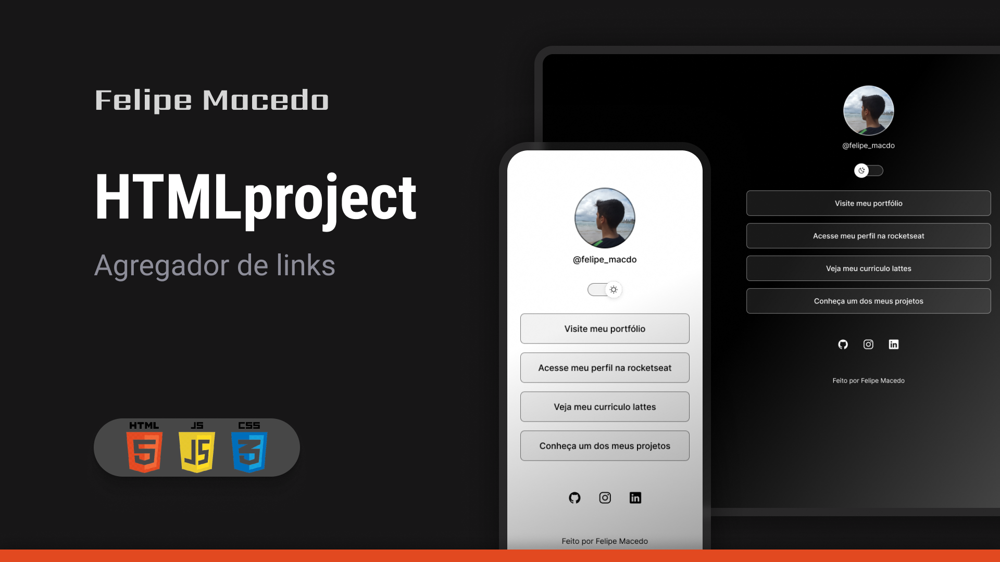

<h1 align="center"> HTMLproject </h1>

Projeto de agregador de links, feito por Felipe Macedo.  

  <a href="#tecnologias">Tecnologias</a>&nbsp;&nbsp;&nbsp;|&nbsp;&nbsp;&nbsp;
  <a href="#projeto">Projeto</a>&nbsp;&nbsp;&nbsp;|&nbsp;&nbsp;&nbsp;
  <a href="#layout">Layout</a>&nbsp;&nbsp;&nbsp;|&nbsp;&nbsp;&nbsp;
<a href="#por">Por</a>

 

  

## Tecnologias

Esse projeto foi desenvolvido com as seguintes tecnologias:

- HTML
- CSS
- JavaScript
- Git
- Github
- Figma

## Projeto

O HTMLproject é um agregador de links que pode ser usado como cartão de visitas online.

- [Acesse o projeto finalizado, online](https://github.com/FelipeMacedo10/HTMLproject)

## Layout

Você pode visualizar o layout do projeto através [DESSE LINK](https://www.figma.com/file/L8zQkTkNk44YdHqkdycQy2/HTMLproject-%E2%80%A2-Agregador-de-links-(Felipe-Macedo)?type=design&node-id=10%3A620&mode=design&t=Yd3qniRck95gWJmb-1). É necessário ter conta no [Figma](https://figma.com) para acessá-lo.

## Por

Felipe Macedo
